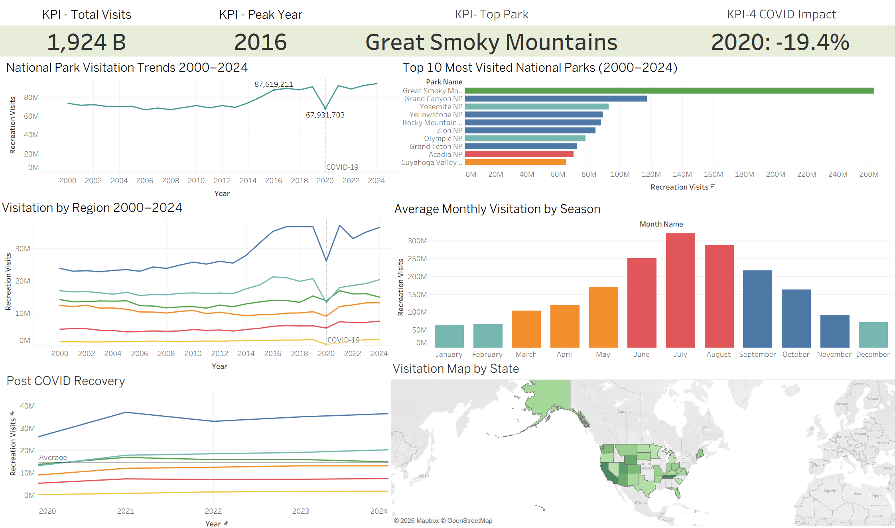

# National Parks BI Dashboard

An end-to-end business intelligence project analyzing 25 years of National Park Service visitation data across 63 parks (2000–2024).

## Dashboard
Download the packaged Tableau workbook to explore the full interactive dashboard:
[NationalParkviz.twbx](dashboard/NationalParkviz.twbx)



---

## Project Overview

Raw NPS visitation data lacked a queryable structure for trend analysis. To solve this, I designed and built a normalized star schema database from scratch in SQLite, engineered an ETL pipeline to stage, validate, and load 18,851 records into fact and dimension tables with zero referential integrity errors, created 5 analytical views using window functions and conditional aggregation, and connected to Tableau Desktop Professional to deliver an interactive multi-dimensional dashboard.

---

## Key Insights

- **Great Smoky Mountains** is the most visited national park of all time — 2.6B visits over 25 years
- **2016** was peak visitation year nationally with 87.6M recreation visits
- **Glacier Bay** lost 99.1% of visitors in 2020 — the hardest COVID-19 impact of any park
- **Summer** accounts for the majority of annual visitation across all parks and regions
- **Pacific West and Intermountain** regions lead in total visits nationally

---

## Tech Stack

| Tool | Purpose |
|---|---|
| SQLite | Star schema design, ETL, analytical views |
| SQL | Schema creation, data loading, window functions, validation |
| Python | CSV staging pipeline into SQLite |
| Tableau Desktop Professional | Interactive dashboard and visualization |

---

## Database Architecture

Star schema with 3 tables and a staging layer:

```
staging_raw        ← raw CSV loaded via Python
      |
      ├── dim_parks    (63 parks — name, region, state)
      ├── dim_date     (300 months — year, month, season, quarter)
      └── fact_visits  (18,851 rows — monthly visitation metrics)
```

**fact_visits** sits at the center with foreign keys to both dimension tables, enabling efficient multi-dimensional queries across park, time, and geography.

---

## SQL Concepts Demonstrated

- Star schema design with primary keys, foreign keys, and CHECK constraints
- ETL pipeline using `INSERT INTO ... SELECT` with `TRIM`, `COALESCE`, and `CASE WHEN`
- Surrogate key generation: `DateKey = (Year * 100) + Month`
- Analytical views using `RANK()` and `LAG()` window functions
- Conditional aggregation for COVID impact pivot (2019 vs 2020)
- Referential integrity validation using `LEFT JOIN` orphan checks
- Index creation on foreign key columns for query performance

---

## Dashboard Views

| Sheet | Chart Type | Key Question Answered |
|---|---|---|
| Annual Trends | Line chart | How has visitation changed over 25 years? |
| Top 10 Parks | Horizontal bar | Which parks drive the most visits? |
| Regional Breakdown | Multi-line chart | How do regions compare over time? |
| Seasonal Patterns | Bar chart | When do people visit national parks? |
| COVID Impact | Grouped bar | Which parks were hit hardest in 2020? |
| Post-COVID Recovery | Line chart | How fast did parks recover after 2020? |
| Visitation by State | Geographic map | Where are visits concentrated geographically? |

---

## Project Structure

```
national-parks-bi/
├── README.md
├── data/
│   └── national_parks_clean.csv       # Cleaned source data (18,851 rows)
├── sql/
│   └── national_parks_master.sql      # Complete build script — schema, ETL, views
├── queries/
│   └── national_parks_practice_queries.sql   # 10 analytical queries beginner to advanced
├── dashboard/
│   └── NationalParkviz.twbx           # Packaged Tableau workbook
└── assets/
    └── NPDashboard.png                # Dashboard screenshot
```

---

## How to Run

**To rebuild the database from scratch:**
1. Open `sql/national_parks_master.sql` in VS Code with the SQLite extension
2. Run each section in order — schema, dim_parks, dim_date, fact_visits, views
3. Final validation should return 63 parks, 300 months, 18,851 rows, 0 orphans

**To explore the dashboard:**
1. Download `dashboard/NationalParkviz.twbx`
2. Open with Tableau Desktop

---

## Data Source

National Park Service — Public Use Statistics Office
Visitation data 2000–2024 across 63 National Parks
[NPS Stats Website](https://irma.nps.gov/Stats/)

---

*Built by Justin Perry — Business Analytics, University of Tennessee 2026*
*Portfolio: justinperry1511-hash.github.io/portfolio*
